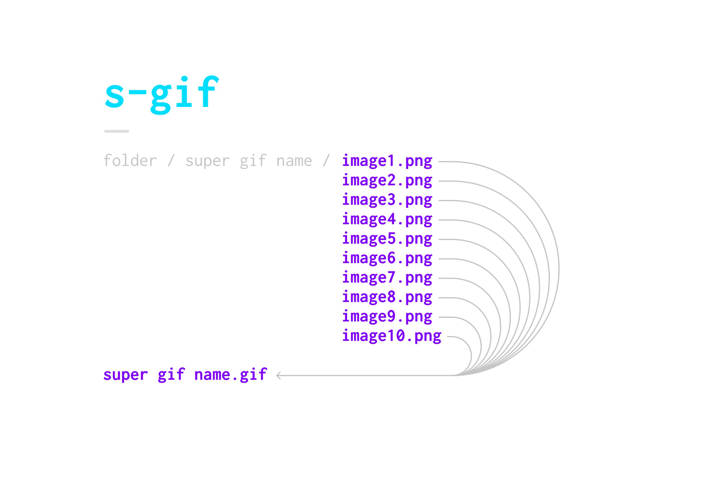

### About
- You have many image sequences? ✓
- You want to convert them into gifs? ✓
- You don't want to touch Photoshop? ✓

Make yourself at home, you have come to the right place! s-gif iterates over a directory and combines all files from each folder into a gif (with the same name as the folder) and places it into the parent directory.

### How to run
3. Open `Terminal` on your Mac (or the equivalent on your OS)
4. In Terminal, navigate to the folder you want to iterate through
5. Enter the command `python path/to/makegif.py` (you can drag and drop the python file into the terminal to get its path or you just put it where it should be run)
6. Done – all your images are now gifs

### Gif Sources
Example .gif sources taken from [Giphy](http://giphy.com/search/mickey-mouse)

### Cost (License)
0 € – it's **public domain**